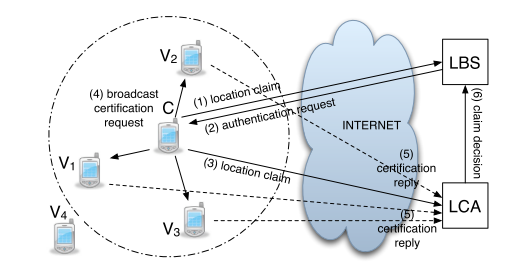
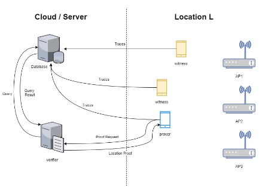

# SureThing Signature Specification (ST-SS)
## Abstract
This document describes specification of the SureThing Signature library, a cryptographic digital signature scheme that describes how to use cryptographic algorithms to create and verify digital signature in location claims, endorsements, and certificates datatypes defined in the core data library of the framework.

The described specification MAY be implemented in different programming languages, as a library that can be included in location proof applications.

The readers are assumed to be familiar with basic knowledge of cryptography and digital signature programming.

The procedures specified in this document MUST be implemented in the SureThing Signature Specification Reference Implementation (ST-SS-RI), that is authoritative in regard to implementation details, whenever there are omissions in this document.


## Requirements Language

The key words "MUST", "MUST NOT", "REQUIRED", "SHALL", "SHALL NOT", "SHOULD", "SHOULD NOT", "RECOMMENDED", "MAY", and "OPTIONAL" in this document are to be interpreted as described in [RFC 2119](https://datatracker.ietf.org/doc/html/rfc2119).


### Copyright Notice

Copyright (c) 2022 INESC-ID

---

## Introduction
introduce this specification showing the importance of the signature library in the SureThing framework.


## Terminologies
Terminologies used in this specification:

* Digital Signature: For the purposes of this specification, we use this term for digital signatures using public key algorithms, which can provide both authenticity and  non-repudiation.
* Certification Authority:
* Public Key:
* Private Key:
* Prover: the entity that generates signed location claims, signed using a private key.
* Witness:
* Verifier: the entity that verifies the authenticity of signed location claims, endorsements, and certificates.
* Location claim:
* Location Endorsement:
* Location Certificate:
* Signed [Claim / endorsement/ Certificate]: The data or message upon which a digital signature has been computed. The structures of these messages are defined in the Core Data library.
* Core Data: a library contains the definition of the main data strtuctures used in the SureThing framework (i.e. location claim , endorsement and certification).
* Core Util: the implementation library of this specification.

## Signature Overview and Examples
The implementation of this library is mainly associated to the data types defined by the framework in the Data Core library. Therefore, it MUST satisfy the description in the following scenario.

The Prover usually makes location claims and these claims MUST be signed with his/her credentials. The  Witness, in turn, may receive a signed location claim, and therefore, it MUST verify the signature of the claim. The Witness also may decide to endorse a claim, and thus, it MUST sign the endorsement with his/her credentials. The Verifier, on the other side of the communication, needs to verify the signatures of the Prover and the Witnesses. Upon a successful verification of the provided evidence in the claim, the verifier produces a location certificate and it MUST be signed as well. The application that requires the location certificate needs to verify the signature on the
certificate, to accept or reject the location claim.

### Signature for multiple messages
The cryptographic functions, e.g., hash and encryption algorithms, operate over byte arrays and produce byte arrays. All operations in this library rely on an ordered list of byte arrays (call it “ByteArrayList”) to store the generated content of messages and signatures. The array list structure allows the signatures to cover one or multiple messages in the same signature. The list should be initialized and empty at the beginning of every operation.

### Keys
The private keys for making the signatures are known only to their respective entities, while the public keys for verifying the signatures are either known in advance or certified by a trusted Certificate Authority (CA), so that they can be obtained and verified. The public keys of the trusted CAs have to be known in advance.

## Communication Topology
The possible communication topologies between the entities. The type of communication toplogy affects the flow of the signature generation and verification.

### Ad hoc
short-range communication between the prover and its nearby witnesses. (TODO: draw the images)



#### Steps
* prover broadcast request messages to nearby witnesses asking for endorsement - 
* witness answers with en endorsement
* prover creates locatio claim and send to verifier
* verifier generates certificate for the prover.

### Opportunistic
witnesses report their observations directly to the verifier to provides evidence for a location. Here the prover has no direct communication with the witnesses.



#### Steps
* witnesses send endorsements to the verifier reporting evidence of a location
* prover creates location claim and sends to the verifier
* verifier generates certificate for the prover, after verifiying the claim of the prover and the endorsements of the witnesses.

## Signature Generation
The cryptographic functions -- e.g. hash and encryption algorithms -- operate over byte arrays, and produce byte arrays.

For all of the following procedures, we rely on an ordered list of byte arrays, that we call the *ByteArrayList*.
At the beginning of each procedure, the ByteArrayList is inicialized and empty.
This list is important because it is allows the signatures to cover one or more message structures in the same signature.

*To produce a signature*, all of the items in the ByteArrayList are hashed in sequence, from the first on the list, until the last of the last.
The final hash is encrypted with the private key to produce the signature value.

*To verify a signature*, all of the items in the ByteArrayList are again hashed in sequence.

### Claim Signature

To sign a claim:

The `proverId` field must be set.
The prover must have its private key.

Serialize the claim protobuf message.
Add the result to the tail of the ByteArrayList.

Create a `Signature` message.

Pick one signature algorithm from the supported list.
Set the `cryptoAlgo` identifier using the identifier.

Generate a random number and set the `nonce` field.

Set the `value` field to 0 (default value).
Serialize the signature message.
Add the result to the tail of the ByteArrayList.

Process ByteArrayList in order to produce the hash.

Encrypt the resulting hash with the asymmetric cipher.

Store the resulting byte array in the `value` field.

Create a `SignedLocationClaim` message.
Set the `claim` and the `proverSignature` fields.

This is the result.

### Endorsement Signature

Resolve the `claimId`.

Serialize `SignedLocationClaim` and add to ByteArrayList.

Fill in the `witnessId`.

Serialize `LocationEndorsement` and add to ByteArrayList.

Create and fill-in a `Signature` message (same as claim).
Process the ByteArrayList.

Create a `SignedLocationEndorsement` message.
Set the `endorsement` and the `witnessSignature` fields.

This is the result.

### Verification (certificate) Signature

This procedure outputs a Location Certificate.

Resolve claim, serialize, add to ByteArrayList.

For each endorsement: serialize and add to ByteArrayList.

Create and fill-in `Signature`.

Create `LocationCertificate` message.
Set the `verification` and the `verifierSignature` fields.

This is the result.


## Signature Verificaion

### Claim signature

Receive a `SignedLocationClaim`.

Resolve proverId and retrieve its public key.

Go to `Signature`, extract `value`.
Decrypt with public key.
This is the deciphered hash value.

Serialize claim, add to tail of ByteArrayList.

Zero the signature value. Add to tail of ByteArrayList.

Produce hash from ByteArrayList.

If computed hash is exactly the same (byte-to-byte comparison) with deciphered hash, then the signature is valid.

### Endorsement signature

Receive a `SignedLocationEndorsement`.

Resolve proverId and retrieve its public key.

Go to `Signature`, extract `value`.
Decrypt with public key.
This is the deciphered hash value.

Serialize claim, add to tail of ByteArrayList.

Zero the signature value. Add to tail of ByteArrayList.

Produce hash from ByteArrayList.

If computed hash is exactly the same (byte-to-byte comparison) with deciphered hash, then the signature is valid.

### Certificate signature


Receive a `LocationCertificate`.

Resolve proverId and retrieve its public key.

Go to `Signature`, extract `value`.
Decrypt with public key.
This is the deciphered hash value.

Serialize claim, add to tail of ByteArrayList.

Zero the signature value. Add to tail of ByteArrayList.

Produce hash from ByteArrayList.

If computed hash is exactly the same (byte-to-byte comparison) with deciphered hash, then the signature is valid.


## Core Signature Syntax

### The Signature element
```

syntax = "proto3";

package eu.surething_project.core;

option java_multiple_files = true;
option java_package = "eu.surething_project.core";
option java_outer_classname = "SignatureProto";

option go_package = "eu.surething_project.core";

// signature definition
message Signature {
  bytes value = 1; // binary value of signature
  string cryptoAlgo = 2; // identification of cryptographic signature algorithm
  int64 nonce = 3; // number used once - to assure message freshness
}
```

### Metadata

### Identifier reference resolving

## Algorithms

### Message Digests

* SHA-3
* BLAKE2

### Signature Algorithms
* ECDSA - secp256k1, secp256r1

### CA certificate format
* X.509
certificate
* Elliptic Curve Qu-Vanstone Implicit Certificate
Scheme (ECQV) and MES encoding for IoT devices

### Identifiers and Implementation Requirements

---

## References

XML Signature Syntax and Processing Version 1.1 - 2013 - <http://www.w3.org/TR/2013/REC-xmldsig-core1-20130411/>

JSON Web Signature (JWS) - 2015 - <https://datatracker.ietf.org/doc/html/rfc7515>

